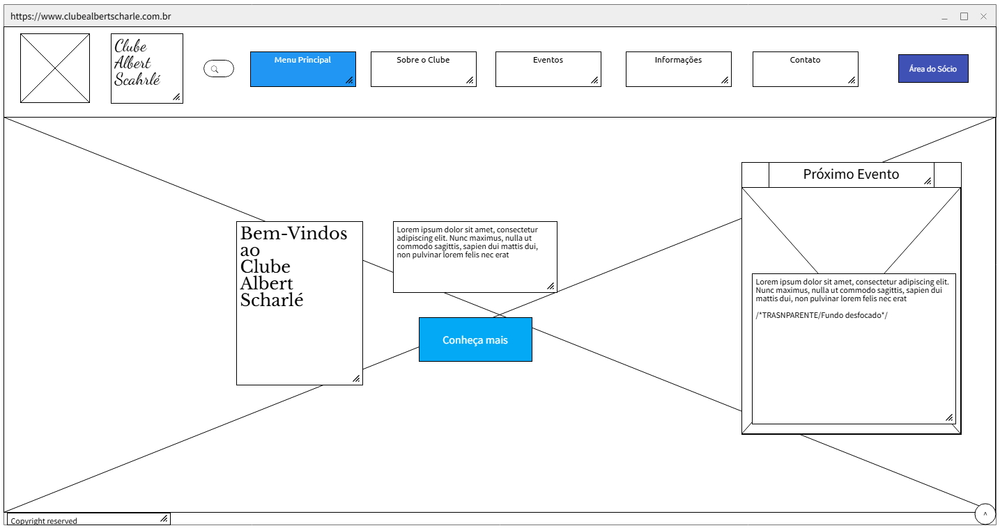
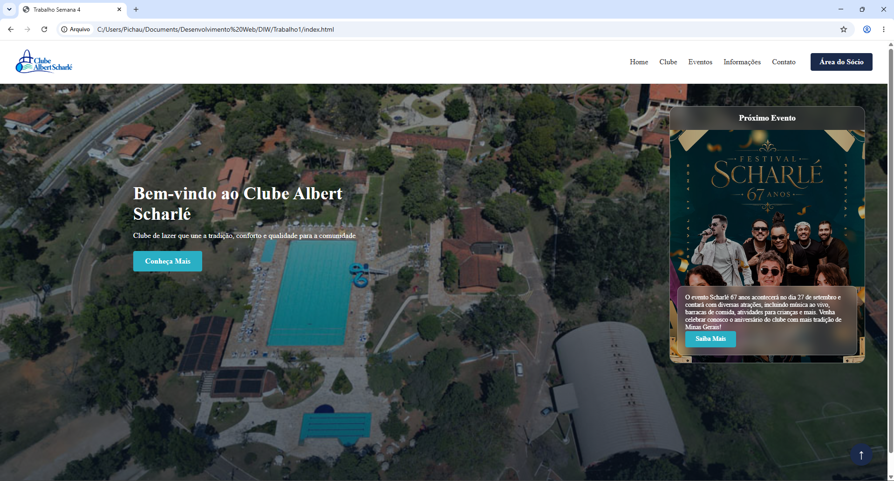

# Site-Trabalho-1

Projetos de Desenvolvimento de Interface Web

Trabalho 1 - Produção de Site
Aluno

Nome: Tiago Henrique Gomes Formiga
Matricula: 926142

A minha ideia foi fazer um site para o clube que minha familia frequenta na cidade que ela veio, Sabará. Como o clube já tinha um site, decidi usar ele como base, tentar fazer algo parecido mas, com diferenças que eu acho que deixariam mais interessantes, como a aba proximo evento, e o botão para voltar ao inicio.
Ficou bem parecido e do jeito que eu gostaria.

Wireframe feito no MockFlow:

Tela da Home do site:
